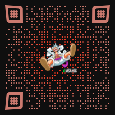
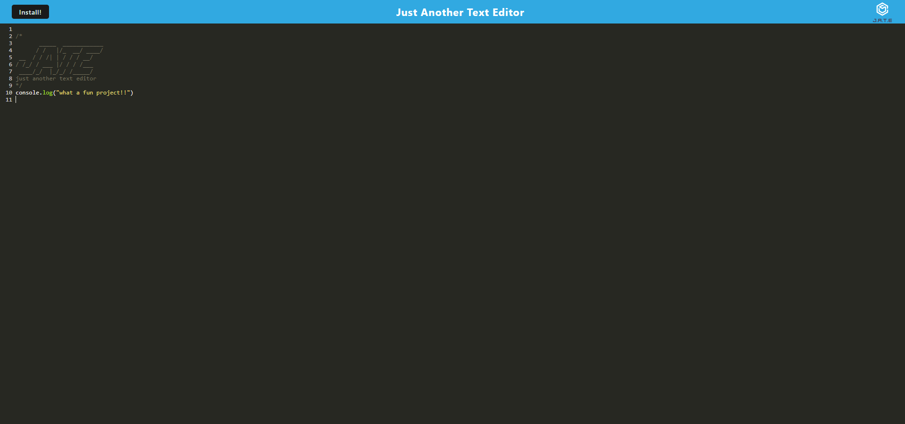

# PWA_TextEditor

<p align='center'>
<a></a>
</p>
## Description

 The PWA text editor is designed as an online and offline platform for users to craft notes and code snippets. Regardless of their internet connection, users can seamlessly compose and store content, assured that their creations will be readily accessible in the future.

## Table of Contents
*[Title](#title)

*[Description](#description)
    
*[Installation](#installation)
    
*[Usage](#usage)
    
*[License](#license)
    
*[Questions](#questions)

*[URL](#URL)
    

## Installation

Building this text editor involves implementing several methods to store data in an IndexedDB database.

For the installation of this application, Node.js and various npm packages are necessary prerequisites.

Node Package Manager (npm) serves as a software manager and installer that places modules in the appropriate locations for the node project's utilization. It effectively manages potential dependency conflicts and is initialized through the npm init command. As a result, a package.json file is generated containing all the application details inputted by the user during npm initialization.

For the smooth functioning of this application, the following npm packages are employed:-

* express (express.js)

* webpack (Webpack)

* webpack-dev-server (webpack-dev-server)

* webpack-pwa-manifest (WebpackPwaManifest)

* babel (Babel)

* css-loader (CSS-loader)

* concurrently (Concurrently, used for running multiple commands concurrently)

* idb (IndexedDB)
To integrate these necessary modules, simply bundle them within the package.json file. By entering the command npm run install in the command-line interface or integrated terminal, the required modules will be automatically installed.

## Usage

``````  
GIVEN a text editor web application, 
WHEN I open my application in my editor
THEN I should see a client server folder structure
``````


## License
[](https://opensource.org/licenses/The_Unlicense)


## badges


             
             


<p align='center'>
<a></a>
<a></a>
</p>


## Questions
Any questions about this project please send me a message on *https://github.com/fordefam12 or email me at [fordefam12@gmail.com]

## URL
  <p align='center'>
<a href='https://github.com/fordefam12/PWA_TextEditor'></a>
</p>

## Screenshots

